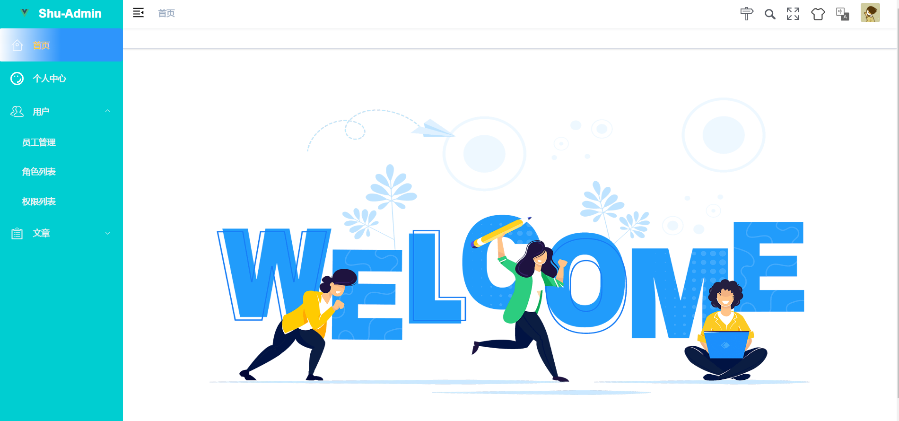
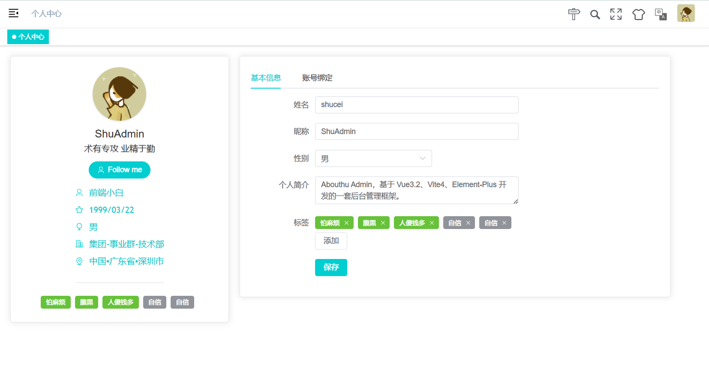
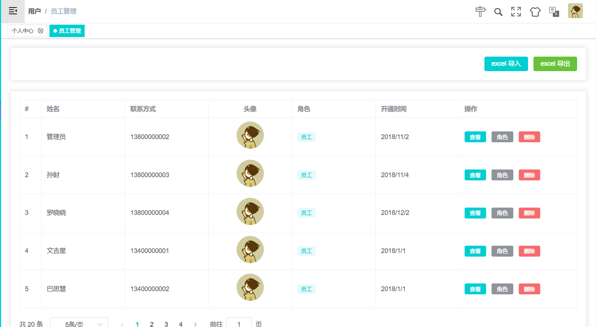
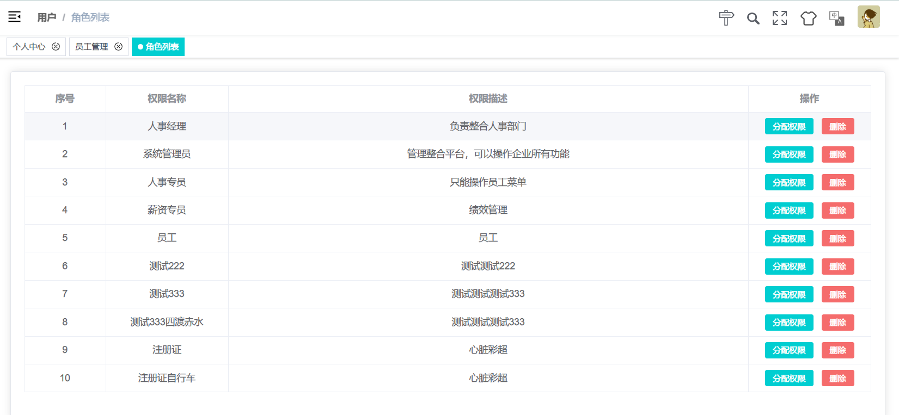
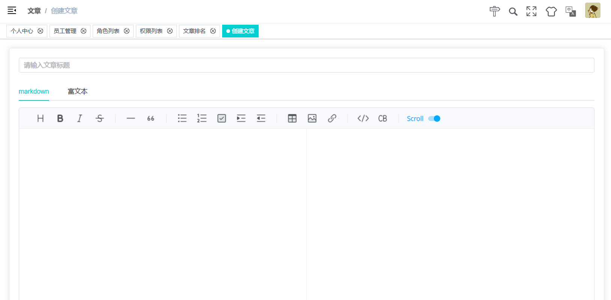

# Shu-Admin

介绍

该项目是一个基于 Vue.js 和 Element UI 的后台管理系统模板，提供了丰富的组件、样式和功能模块，可以用来快速搭建各种类型的后台管理系统。

技术栈：

- 前端框架：Vue3
- UI 库：Element-Plus
- 路由管理：Vue Router
- 状态管理：Vuex
- 构建工具：Vite
- 接口请求：Axios

功能模块：

1、登录模块：提供登录表单等组件，支持用户登录和退出。

2、首页模块：展示系统的概要信息和各个功能模块的入口，包括菜单导航、面包屑导航、消息通知等。

3、用户管理模块：包括用户列表、用户详情、用户编辑等页面，支持用户信息的增删改查等操作。

4、权限管理模块：包括角色列表、角色编辑、权限列表、权限编辑等页面，支持权限的细粒度控制和角色的分配。

5、日志管理模块：包括系统日志、操作日志等页面，支持日志的查询和导出。

项目功能

- [x] 使用 husky、lint-staged、commitlint、commitizen、cz-git 规范提交信息
- [x] 使用 Prettier 统一格式化代码，集成 Eslint、Stylelint 代码校验规范
- [x] 采用 Vite4 作为项目开发、打包工具（配置 Gzip 打包、TSX 语法、跨域代理……）
- [x] 支持 Element 组件大小切换、暗黑模式、i18n 国际化
- [x] 使用 VueRouter 进行路由权限拦截、页面按钮权限配置、路由懒加载
- [x] 使用 keepAlive 对页面进行缓存，支持多级嵌套页面缓存

```
npm run dev
```

```
yarn dev
```












> > > > > > > 976a4154f28894a7cd4557894ea0f38a6e27acf0
